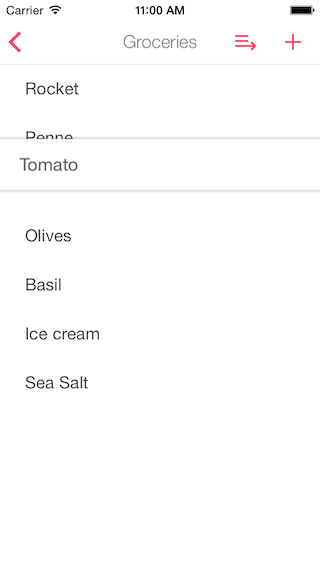

# NBReorderTableView

[](http://cocoadocs.org/docsets/NBReorderTableView)
[](http://cocoadocs.org/docsets/NBReorderTableView)
[](http://cocoadocs.org/docsets/NBReorderTableView)


NBReorderTableView is a `UITableView` subclass to support reordering cells with long press. This is being used in production on --[Listary](http://listaryapp.com)-- and [Todoist for iOS](http://todoist.com)



## Installation

NBReorderTableView is available through [CocoaPods](http://cocoapods.org). To install
it, simply add the following line to your Podfile:

    pod "NBReorderTableView", '~> 0.1'

## Usage

Just use a `NBReorderTableView` table view.

```objective-c
UITableView *tableView = [NBReorderTableView new];
```

Implement, at least, the `tableView:placeholderViewForReorderingCell:`
delegate method to return your own view representation of the cell being reordered. See more interesting delegate methods on [`NBReorderTableView.h`](Pod/Classes/NBReorderTableView.h).

```objective-c
- (UIView *)tableView:(UITableView *)tableView placeholderViewForReorderingCell:(UITableViewCell *)cell
{
    // Create an image from the cell being dragged
    UIGraphicsBeginImageContextWithOptions(cell.contentView.bounds.size, NO, 0);
    [cell.contentView.layer renderInContext:UIGraphicsGetCurrentContext()];
    UIImage *cellImage = UIGraphicsGetImageFromCurrentImageContext();
    UIGraphicsEndImageContext();

    // Create the placeholder view to be dragged
    UIImageView *placeholder = [[UIImageView alloc] initWithImage:cellImage];

    // Set the view's frame
    CGRect frame = placeholder.frame;
    frame.origin.y = cell.frame.origin.y;
    placeholder.frame = frame;

    placeholder.layer.shouldRasterize = YES;
    placeholder.layer.shadowOpacity = 0.4;
    placeholder.layer.shadowRadius = 2;
    placeholder.layer.shadowOffset = CGSizeZero;
    placeholder.layer.zPosition = MAXFLOAT;
    [UIView animateWithDuration:0.25 animations:^{
        placeholder.transform = CGAffineTransformMakeScale(1.02, 1.02);
    }];
    placeholder.alpha = 0.8;

    return placeholder;
}
```

And, finally, implement the `tableView:moveRowAtIndexPath:toIndexPath:` data source method to update your data source while the user is reordering the cell.

```objective-c
- (void)tableView:(UITableView *)tableView moveRowAtIndexPath:(NSIndexPath *)sourceIndexPath toIndexPath:(NSIndexPath *)destinationIndexPath
{
    [self.rows exchangeObjectAtIndex:sourceIndexPath.row withObjectAtIndex:destinationIndexPath.row];
}
```

## Author

Nuno Baldaia, http://nunobaldaia.com

## License

NBReorderTableView is available under the MIT license. See the LICENSE file for more info.
